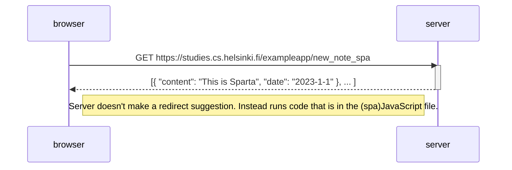

Tee kaavio tilanteesta, jossa käyttäjä luo uuden muistiinpanon single page ‑versiossa

```mermaid
sequenceDiagram
    participant browser
    participant server

    browser->>server: GET https://studies.cs.helsinki.fi/exampleapp/new_note_spa
    activate server
    server-->>browser: [{ "content": "This is Sparta", "date": "2023-1-1" }, ... ]
    deactivate server   

    Note right of browser: Server doesn't make a redirect suggestion. Instead runs code that is in the (spa)JavaScript file. 
    
```